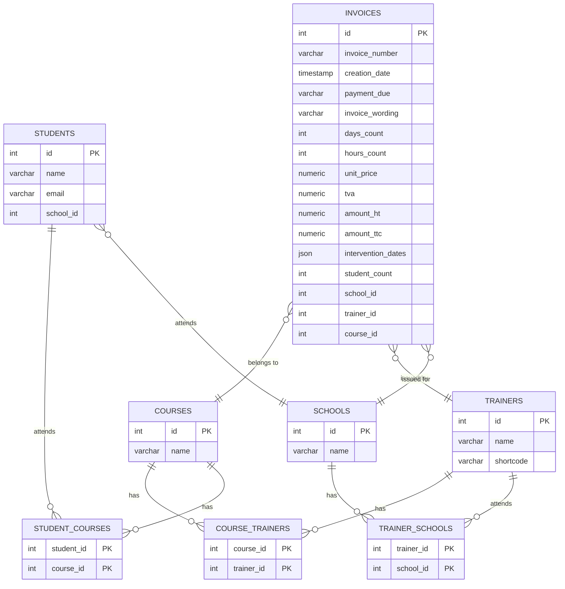

# Proposition d'organisation

## Structure du projet backend avec FastAPI

```txt
features/ 
├── app/
│   ├── features/
│   │   ├──api.py                 # Points d'entrée API FastAPI
│   │   └── invoice_repository.py # Abstraction de l'accès aux données    
│   ├── domain/
│   │   └── invoice_model.py       # Modèle de données SQLAlchemy pour les factures
│   ├── services/
│   │   └── invoice_service.py     # Logique métier pour la gestion des factures
│   ├── schemas/
│   │   └── invoice_schema.py      # Schémas Pydantic pour la validation des données
│   └── infrastructure/
│       └── database.py            # Configuration de la base de données
│   └── main.py                    # Point d'entrée de l'application
└── requirements.txt               # Dépendances du projet

```

### Topologie de l'Architecture de Projet

Cette architecture suit le principe de séparation des préoccupations, en organisant le code en différents modules. Cela facilite la maintenance, la compréhension et les tests de l'application. Voici une vue d'ensemble des différentes parties de l'application :

#### 1. **Dossier `features/`**
Le dossier principal contenant toutes les fonctionnalités de l'application.

##### - `app/`
Le sous-dossier `app` contient les différents composants de l'application. Chaque composant a une responsabilité bien définie.

###### a. **`features/`**
- **`api.py`** : Ce fichier contient les points d'entrée de l'API construite avec FastAPI. Il définit les routes et gère les requêtes HTTP entrantes, en reliant les services aux clients externes. C’est ici que les endpoints de l’application sont déclarés, et les réponses appropriées sont renvoyées.

- **`invoice_repository.py`** : Ce fichier gère l'abstraction de l'accès aux données pour les factures. Il interagit avec la base de données pour effectuer des opérations CRUD (Créer, Lire, Mettre à jour, Supprimer) sur les factures. En utilisant un modèle de repository, ce fichier permet de séparer la logique d'accès aux données de la logique métier, favorisant ainsi la réutilisation et la testabilité.

###### b. **`domain/`**
- **`invoice_model.py`** : Ce fichier contient le modèle de données SQLAlchemy pour les factures. Il définit la structure des données qui seront stockées dans la base de données, ainsi que les relations potentielles entre différentes entités. Cela permet d'établir un cadre clair pour la gestion des données liées aux factures.

###### c. **`services/`**
- **`invoice_service.py`** : Ce fichier contient la logique métier pour la gestion des factures. Il intègre les opérations de l'application, traite les données reçues, et utilise les repositories pour interagir avec la base de données. Cela permet d'encapsuler toute la logique spécifique aux factures dans un seul endroit, facilitant ainsi les modifications et l'extension de l'application.

###### d. **`schemas/`**
- **`invoice_schema.py`** : Ce fichier définit les schémas Pydantic utilisés pour la validation des données. Il spécifie les formats des données attendues lors des requêtes et des réponses de l'API, assurant ainsi que seules des données valides soient traitées. Cela aide également à documenter l'API en fournissant des informations claires sur les types de données attendus.

###### e. **`infrastructure/`**
- **`database.py`** : Ce fichier contient la configuration de la base de données, y compris les paramètres de connexion et l'initialisation des sessions. Il établit les fondations nécessaires pour interagir avec la base de données, et permet d'effectuer des opérations sur les données définies par le modèle.

###### f. **`main.py`**
- **`main.py`** : C'est le point d'entrée de l'application. Il initialise l'application FastAPI, configure les middlewares et les routes, et démarre le serveur. C'est ici que l'application est lancée et prête à recevoir des requêtes.

#### 2. **Fichier `requirements.txt`**
Ce fichier contient toutes les dépendances nécessaires au projet. Il facilite l'installation des packages requis en une seule commande, assurant que tous les développeurs travaillent avec les mêmes versions des bibliothèques.


## Schéma des tables 

### Modélisation

- Schéma des tables 




1. **Un cours** peut être enseigné par **plusieurs formateurs**, et **un formateur** peut enseigner **plusieurs cours**.
   - Relation : Cours ↔ Formateurs (N:N)

2. **Un étudiant** peut s'inscrire à **plusieurs cours**, et **un cours** peut avoir **plusieurs étudiants** inscrits.
   - Relation : Étudiants ↔ Cours (N:N)

3. **Une école** peut avoir **plusieurs étudiants**, mais **un étudiant** est inscrit dans **une seule école**.
   - Relation : École ↔ Étudiants (1:N)

4. **Une école** peut employer **plusieurs formateurs**, et **un formateur** peut travailler dans **plusieurs écoles**.
   - Relation : Écoles ↔ Formateurs (N:N)

5. **Une facture** est liée à **un cours**, **un formateur**, et **une école**. 
   - Relation : Facture ↔ Cours, Formateur, École (1:1:1)

Ces phrases simples décrivent les relations principales entre les entités dans votre modèle de données.