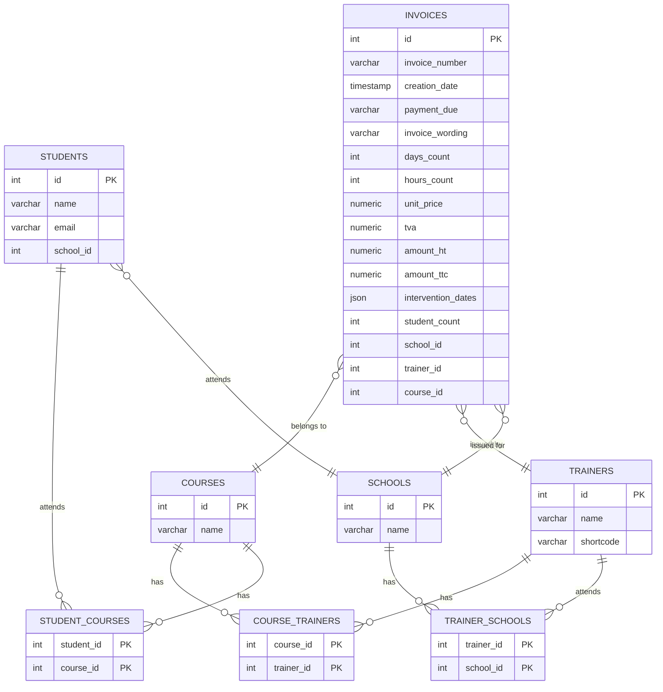

# Proposition d'organisation

## Structure du projet backend avec FastAPI

```txt
features/ 
├── app/
│   ├── features/
│   │   ├──api.py                 # Points d'entrée API FastAPI
│   │   └── invoice_repository.py # Abstraction de l'accès aux données    
│   ├── domain/
│   │   └── invoice_model.py       # Modèle de données SQLAlchemy pour les factures
│   ├── services/
│   │   └── invoice_service.py     # Logique métier pour la gestion des factures
│   ├── schemas/
│   │   └── invoice_schema.py      # Schémas Pydantic pour la validation des données
│   └── infrastructure/
│       └── database.py            # Configuration de la base de données
│   └── main.py                    # Point d'entrée de l'application
└── requirements.txt               # Dépendances du projet

```

### Topologie de l'Architecture de Projet

Cette architecture suit le principe de séparation des préoccupations, en organisant le code en différents modules. Cela facilite la maintenance, la compréhension et les tests de l'application. Voici une vue d'ensemble des différentes parties de l'application :

#### 1. **Dossier `features/`**
Le dossier principal contenant toutes les fonctionnalités de l'application.

##### - `app/`
Le sous-dossier `app` contient les différents composants de l'application. Chaque composant a une responsabilité bien définie.

###### a. **`features/`**
- **`api.py`** : Ce fichier contient les points d'entrée de l'API construite avec FastAPI. Il définit les routes et gère les requêtes HTTP entrantes, en reliant les services aux clients externes. C’est ici que les endpoints de l’application sont déclarés, et les réponses appropriées sont renvoyées.

- **`invoice_repository.py`** : Ce fichier gère l'abstraction de l'accès aux données pour les factures. Il interagit avec la base de données pour effectuer des opérations CRUD (Créer, Lire, Mettre à jour, Supprimer) sur les factures. En utilisant un modèle de repository, ce fichier permet de séparer la logique d'accès aux données de la logique métier, favorisant ainsi la réutilisation et la testabilité.

###### b. **`domain/`**
- **`invoice_model.py`** : Ce fichier contient le modèle de données SQLAlchemy pour les factures. Il définit la structure des données qui seront stockées dans la base de données, ainsi que les relations potentielles entre différentes entités. Cela permet d'établir un cadre clair pour la gestion des données liées aux factures.

###### c. **`services/`**
- **`invoice_service.py`** : Ce fichier contient la logique métier pour la gestion des factures. Il intègre les opérations de l'application, traite les données reçues, et utilise les repositories pour interagir avec la base de données. Cela permet d'encapsuler toute la logique spécifique aux factures dans un seul endroit, facilitant ainsi les modifications et l'extension de l'application.

###### d. **`schemas/`**
- **`invoice_schema.py`** : Ce fichier définit les schémas Pydantic utilisés pour la validation des données. Il spécifie les formats des données attendues lors des requêtes et des réponses de l'API, assurant ainsi que seules des données valides soient traitées. Cela aide également à documenter l'API en fournissant des informations claires sur les types de données attendus.

###### e. **`infrastructure/`**
- **`database.py`** : Ce fichier contient la configuration de la base de données, y compris les paramètres de connexion et l'initialisation des sessions. Il établit les fondations nécessaires pour interagir avec la base de données, et permet d'effectuer des opérations sur les données définies par le modèle.

###### f. **`main.py`**
- **`main.py`** : C'est le point d'entrée de l'application. Il initialise l'application FastAPI, configure les middlewares et les routes, et démarre le serveur. C'est ici que l'application est lancée et prête à recevoir des requêtes.

#### 2. **Fichier `requirements.txt`**
Ce fichier contient toutes les dépendances nécessaires au projet. Il facilite l'installation des packages requis en une seule commande, assurant que tous les développeurs travaillent avec les mêmes versions des bibliothèques.


## Schéma des tables 

### Modélisation

- Schéma des tables 




1. **Un cours** peut être enseigné par **plusieurs formateurs**, et **un formateur** peut enseigner **plusieurs cours**.
   - Relation : Cours ↔ Formateurs (N:N)

2. **Un étudiant** peut s'inscrire à **plusieurs cours**, et **un cours** peut avoir **plusieurs étudiants** inscrits.
   - Relation : Étudiants ↔ Cours (N:N)

3. **Une école** peut avoir **plusieurs étudiants**, mais **un étudiant** est inscrit dans **une seule école**.
   - Relation : École ↔ Étudiants (1:N)

4. **Une école** peut employer **plusieurs formateurs**, et **un formateur** peut travailler dans **plusieurs écoles**.
   - Relation : Écoles ↔ Formateurs (N:N)

5. **Une facture** est liée à **un cours**, **un formateur**, et **une école**. 
   - Relation : Facture ↔ Cours, Formateur, École (1:1:1)

Ces phrases simples décrivent les relations principales entre les entités dans votre modèle de données.

## La clean Architecture

Dans le cadre d'une architecture Clean, il est courant d'organiser votre code en plusieurs couches distinctes pour maintenir la séparation des préoccupations. Voici comment vous pourriez structurer les différents composants de votre application :

### Structure des Dossiers

1. **Domaine (Domain)** :
   - Contient la logique métier et les règles.
   - Inclut des entités, des valeurs d'objet, et des interfaces (repositories, services).
   - **Exemples** :
     - `entities/` : définitions des modèles comme `Invoice`, `Trainer`, `School`, etc.
     - `repositories/` : interfaces pour l'accès aux données.
     - `services/` : logique métier qui interagit avec les repositories.

2. **Application (Application)** :
   - Contient les cas d'utilisation (Use Cases) qui orchestrent l'interaction entre le domaine et les couches externes.
   - **Exemples** :
     - `use_cases/` : classes qui implémentent la logique des cas d'utilisation.

3. **Infrastructure (Infrastructure)** :
   - Gère la communication avec des systèmes externes comme des bases de données, des API, etc.
   - Peut inclure des implémentations concrètes des repositories définis dans le domaine.
   - **Exemples** :
     - `database/` : configurations de base de données, migrations, etc.
     - `repositories/` : implémentations concrètes des interfaces de repository.

4. **Interface (Interface)** :
   - Gère l'interaction avec les utilisateurs ou d'autres systèmes.
   - Inclut les contrôleurs FastAPI, les modèles de réponse, etc.
   - **Exemples** :
     - `controllers/` : définitions des routes et des points d'entrée de l'API.
     - `schemas/` : définitions de modèles pour la validation et la sérialisation des données (p. ex., avec Pydantic).

### Répartition des Services

- **Services du Domaine** : Si vos services contiennent principalement la logique métier et interagissent avec les entités, ils devraient être placés dans le dossier **Domaine**. Ils peuvent également être appelés par les cas d'utilisation.

- **Services d'Infrastructure** : Si vos services sont liés à des interactions externes (comme l'envoi d'e-mails, les appels API externes, etc.), ils devraient être placés dans le dossier **Infrastructure**.

### Exemple de Structure

```
/app
|-- /domain
|   |-- /entities
|   |   |-- invoice.py
|   |   |-- trainer.py
|   |   |-- school.py
|   |-- /repositories
|   |   |-- invoice_repository.py
|   |   |-- trainer_repository.py
|   |-- /services
|       |-- invoice_service.py
|-- /application
|   |-- /use_cases
|       |-- create_invoice.py
|-- /infrastructure
|   |-- /database
|   |-- /repositories
|       |-- sql_invoice_repository.py
|-- /interface
|   |-- /controllers
|       |-- invoice_controller.py
|   |-- /schemas
|       |-- invoice_schema.py
```

## Exemples Application

Voici un exemple détaillé de la façon dont vous pourriez structurer les cas d'utilisation dans la couche **Application** de votre architecture Clean, en particulier avec des fichiers et des classes qui correspondent à des cas d'utilisation spécifiques.

### Exemple de Cas d'Utilisation

Imaginons que vous ayez un cas d'utilisation pour **Créer une Facture** et un autre pour **Obtenir les Formateurs par École**. Voici comment cela pourrait être organisé :

#### Structure des Dossiers

```
/app
|-- /application
|   |-- /use_cases
|   |   |-- create_invoice.py
|   |   |-- get_trainers_by_school.py
```

### 1. `create_invoice.py`

Voici un exemple de la classe `CreateInvoice` qui gère la création d'une facture.

```python
# /app/application/use_cases/create_invoice.py

from app.domain.entities.invoice import Invoice
from app.domain.repositories.invoice_repository import InvoiceRepository
from app.domain.repositories.trainer_repository import TrainerRepository

class CreateInvoice:
    def __init__(self, invoice_repository: InvoiceRepository, trainer_repository: TrainerRepository):
        self.invoice_repository = invoice_repository
        self.trainer_repository = trainer_repository

    def execute(self, invoice_data):
        # Logique de création de facture
        invoice = Invoice(**invoice_data)  # Création de l'objet Invoice
        self.invoice_repository.save(invoice)  # Sauvegarde dans le dépôt
        return invoice
```

### 2. `get_trainers_by_school.py`

Voici un exemple de la classe `GetTrainersBySchool` qui récupère les formateurs par école.

```python
# /app/application/use_cases/get_trainers_by_school.py

from typing import List
from app.domain.repositories.trainer_repository import TrainerRepository

class GetTrainersBySchool:
    def __init__(self, trainer_repository: TrainerRepository):
        self.trainer_repository = trainer_repository

    def execute(self, school_id: int) -> List[dict]:
        # Logique pour obtenir les formateurs par école
        trainers = self.trainer_repository.get_trainers_per_school(school_id)
        return trainers
```

### Explication des Composants

1. **Dépendances** :
   - Chaque cas d'utilisation prend en paramètres les repositories nécessaires, ce qui permet de respecter le principe de l'inversion des dépendances.

2. **Logique Métier** :
   - La logique métier est encapsulée dans la méthode `execute`, ce qui rend les cas d'utilisation facilement testables et réutilisables.

3. **Retour de Données** :
   - Les méthodes renvoient les résultats au format approprié (par exemple, une instance de `Invoice` ou une liste de dictionnaires pour les formateurs).

### Utilisation dans un Contrôleur

Pour connecter ces cas d'utilisation à une interface (par exemple, une API FastAPI), vous pouvez les appeler depuis vos contrôleurs :

```python
# /app/interface/controllers/invoice_controller.py

from fastapi import APIRouter, HTTPException
from app.application.use_cases.create_invoice import CreateInvoice
from app.application.use_cases.get_trainers_by_school import GetTrainersBySchool

router = APIRouter()

@router.post("/invoices")
def create_invoice(invoice_data: dict):
    use_case = CreateInvoice(invoice_repository, trainer_repository)
    return use_case.execute(invoice_data)

@router.get("/schools/{school_id}/trainers")
def get_trainers_by_school(school_id: int):
    use_case = GetTrainersBySchool(trainer_repository)
    trainers = use_case.execute(school_id)
    if not trainers:
        raise HTTPException(status_code=404, detail="No trainers found for this school")
    return trainers
```

### Conclusion

Cette structure permet de garder votre code bien organisé et de séparer clairement la logique métier des détails d'implémentation, facilitant ainsi la maintenance et les tests. Chaque cas d'utilisation a une responsabilité spécifique, ce qui le rend facile à comprendre et à modifier.
